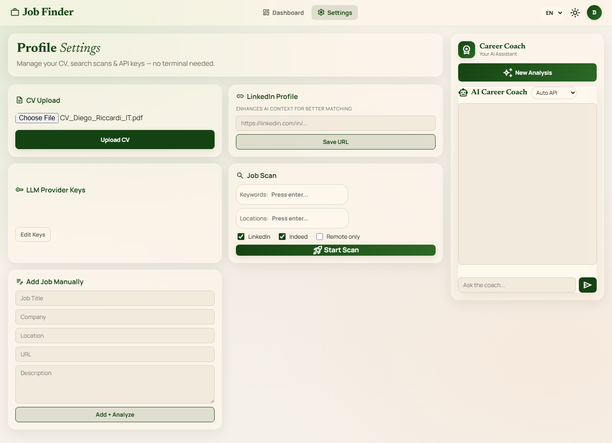
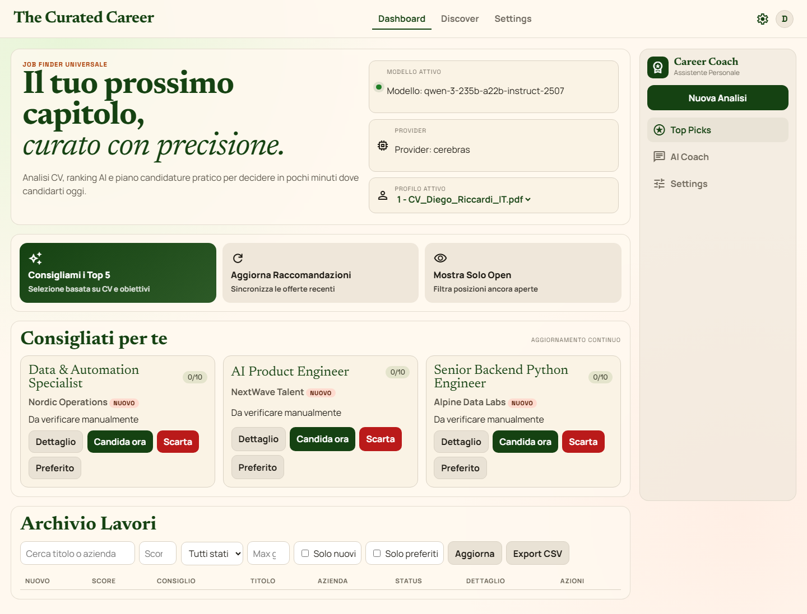
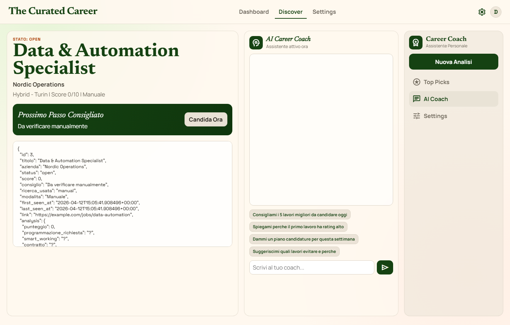
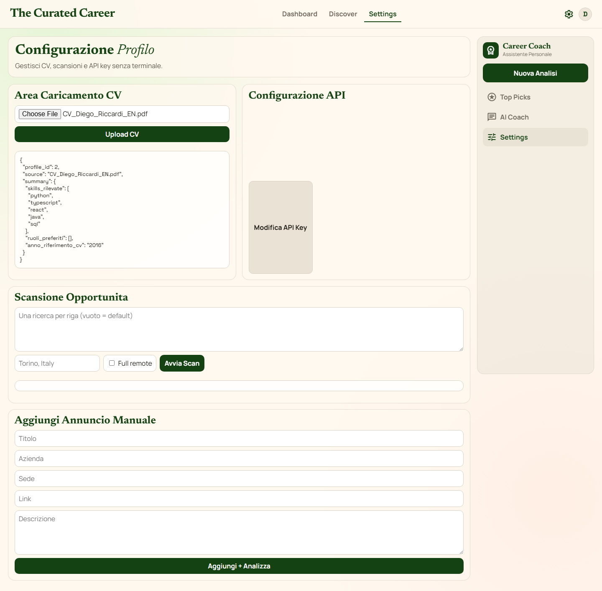
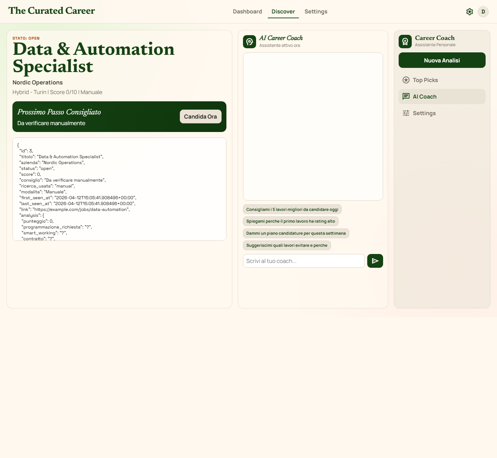

# Linkedin Searcher - Runtime Clean

Versione pulita della web app locale.

Obiettivo: cercare lavori, analizzarli con AI, gestire stato candidatura, usare chat coach.
Uso previsto: 1 persona per PC (tu e il tuo amico ognuno sul proprio computer, con i propri dati locali).

## Cosa c'e adesso nella cartella

- app/: backend FastAPI e logica applicativa
- web/: interfaccia browser
- run_webapp.py: avvio server locale
- requirements.txt: dipendenze runtime
- README.md: guida uso

Non ci sono piu file legacy, storico CSV, CV personale o test/dev script.

## Screenshot Reali Desktop (CV IT + EN)

Queste immagini sono state generate con test browser automatici Playwright usando i tuoi PDF locali IT/EN.

CV Italiano caricato (Settings):



Dashboard con raccomandazioni (profilo IT):



Dettaglio top job (profilo IT):



CV Inglese caricato (Settings):



Dashboard con raccomandazioni (profilo EN):


Dettaglio top job (profilo EN):



Lavori consigliati mostrati nei test:

- Data & Automation Specialist (Nordic Operations)
- AI Product Engineer (NextWave Talent)
- Senior Backend Python Engineer (Alpine Data Labs)

Nota: con API key non valida il sistema mostra consiglio "Da verificare manualmente" e punteggio 0/10. Con key corretta gli score e i consigli AI vengono calcolati normalmente.

## Requisiti

- Python 3.11+
- Connessione internet
- Almeno una API key LLM, impostabile direttamente dalla pagina web
	- Cerebras
	- Groq
	- OpenAI
	- Claude (Anthropic)
	- Google Gemini

## Setup rapido (prima esecuzione)

1. Apri terminale nella cartella progetto.
2. (Opzionale ma consigliato) attiva venv.
3. Installa dipendenze:

```powershell
python -m pip install -r requirements.txt
```

4. Avvia l'app, poi inserisci le key direttamente dalla sezione web "Configurazione API".
	- Puoi anche scegliere il provider primario dalla UI.

## Avvio app

```powershell
python run_webapp.py
```

Apri nel browser:

- http://127.0.0.1:8000

## Verifica tecnica base

Controlla health endpoint:

```powershell
Invoke-RestMethod http://127.0.0.1:8000/api/health | ConvertTo-Json -Depth 8
```

Deve risultare:

- ok: true
- active_provider valorizzato
- active_model valorizzato

Se active_provider e "none", inserisci una key dalla UI e premi "Salva Key".

## Test funzionale passo-passo

1. Carica CV
- In UI: sezione "Carica CV"
- Formati supportati: md, txt, pdf, docx

2. Controlla profilo attivo
- In alto deve apparire il profilo nel selettore

3. Aggiungi annuncio manuale
- Compila titolo/azienda/descrizione
- Premi "Aggiungi + Analizza"
- Verifica comparsa in tabella con score e consiglio

4. Apri dettaglio rating
- Premi "Dettaglio" su una riga
- Verifica JSON con campi analisi (consiglio, punti forza/deboli, ral, ecc.)

5. Prova azioni stato
- Candidata
- Scarta
- Riapri
- Preferito

6. Prova filtri
- Solo nuovi
- Solo preferiti
- Score minimo
- Stato
- Ricerca testo
- Max giorni

7. Prova chat coach
- Messaggio esempio: "consigliami i 3 lavori migliori da candidare"
- Verifica risposta e storico chat

8. Esegui scansione reale
- Inserisci 1-3 query nel box scansione
- Avvia scan
- Verifica nuovi annunci e badge "Nuovo"

9. Export CSV
- Premi "Export CSV"
- Verifica file creato in root progetto

## Aggiornare app in futuro (tu push, lui pull)

Sul PC del tuo amico:

```powershell
git pull
python -m pip install -r requirements.txt
python run_webapp.py
```

Checklist ultra rapida da mandare al tuo amico:

- [CHECKLIST_INIZIALE_2_MIN.md](CHECKLIST_INIZIALE_2_MIN.md)

## Test E2E con Playwright (consigliato per repo pubblica)

1. Installa dipendenze frontend test:

```powershell
npm install
```

2. Installa browser Playwright:

```powershell
npx playwright install chromium
```

3. Lancia i test E2E:

```powershell
npm run test:e2e
```

I test verificano caricamento UI, navigazione Dashboard/Discover/Settings, presenza configurazione multi-provider e flusso chat base.

## Dati locali e backup

Il database locale viene salvato in:

- data/searcher.db

Backup consigliato prima di update grossi:

```powershell
Copy-Item data/searcher.db data/searcher_backup.db
```

## Troubleshooting rapido

1. Modulo mancante

```powershell
python -m pip install -r requirements.txt
```

2. Porta 8000 occupata
- Chiudi il processo che usa la porta

3. Provider non attivo
- Inserisci una key nella sezione "Configura API Key" della UI
- Poi ricontrolla /api/health

4. PDF o DOCX non letto
- Verifica installazione pypdf e python-docx

## Sicurezza minima

- Non committare API key
- Non caricare CV personali sensibili in repo pubbliche
- Usa il DB solo su macchina fidata
