# Job Finder — AI-Powered Job Search Assistant

[](https://python.org)
[](https://fastapi.tiangolo.com)
[](https://sqlite.org)
[](https://github.com/DiegoRiccardi1234/job-finder/actions/workflows/tests.yml)
[](https://github.com/DiegoRiccardi1234/job-finder/actions/workflows/tests.yml)
[](LICENSE)
[](#supported-llm-providers)
[](https://mypy.readthedocs.io/)
[](https://github.com/astral-sh/ruff)
[](CHANGELOG.md)
[](https://github.com/DiegoRiccardi1234/job-finder/releases/latest)

> A localhost-first AI-powered job search assistant. Scrape LinkedIn & Indeed, score offers against your CV with the LLM of your choice, and plan applications from a single dashboard.

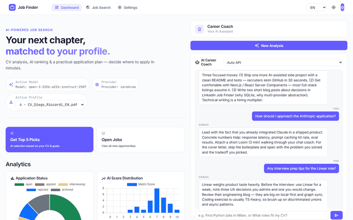

> Upload CV → AI Coach suggests roles → one-click scan with live AI scoring.

---

## For non-developers (Windows)

Don't want to install Python? Grab the standalone Windows bundle from the [latest release](https://github.com/DiegoRiccardi1234/job-finder/releases/latest):

1. Download `JobFinder-windows.zip` from the release assets.
2. Right-click → "Extract All" anywhere you like.
3. Open the extracted folder and double-click `JobFinder.exe`.
4. Your browser opens automatically on `http://127.0.0.1:8000`.
5. The app shows a "No API key configured" banner — click **Get a free Cerebras key** to register (no credit card, free tier, 30 seconds), copy your key into **Settings → API keys**, you're done.

Everything stays on your machine: the SQLite DB, your CV, your notes. The bundle is just Python packaged as a single executable, no telemetry, no remote calls except the LLM provider you configure and the LinkedIn / Indeed scrape.

> **Windows SmartScreen**: the first launch may show "Windows protected your PC". Click **More info** → **Run anyway**. The exe is unsigned (code-signing certificates cost ~$200/year and are out of scope for a personal project).

### Updates

When a new release ships, the dashboard surfaces an "Update available" banner. Click **Update now** — the app downloads the new version, replaces its files, and restarts itself, keeping all your data (CV, jobs, settings, API keys).

---

## Why this project

I built Job Finder while preparing my own transition into IT. Existing job boards push generic listings and waste hours on roles that don't fit. I wanted a tool that:

- knows my CV and preferences,
- scrapes real listings,
- ranks them with an LLM I control,
- and keeps everything **on my machine** — no third-party dashboard owns my data.

The result is a portfolio-grade FastAPI app with a multi-provider LLM backbone, a chat-driven UX, and an honest fallback when the network or the model is down.

---

## Features

- **Smart CV analysis** — Upload PDF / DOCX / TXT or images (JPG / PNG / AVIF / WEBP / TIFF / BMP / SVG). Scanned PDFs and image CVs are read via Tesseract OCR; the LLM extracts skills, seniority, languages, and ideal roles — with the narrative summary written in your UI language (v1.5.0+).
- **Profile tab** — Inspect what the AI understood from your CV, edit `preferred_roles` / `skills` / `languages` inline (chip-list with PATCH), switch between previously uploaded CVs (multi-CV history with **Set active**, delete unwanted CVs).
- **AI Career Coach** — Chat that learns your preferences, suggests search terms via clickable role pills, and can autofill the scan form via structured `action` payloads. Quick-prompt suggestions derived from your CV. Override the active provider **and model** per turn; a one-shot toast offers to persist the choice as default.
- **Provider cards** (Settings) — One card per LLM (Cerebras, Groq, OpenAI, Anthropic, Google, OpenRouter, DeepSeek, xAI/Grok, Zhipu GLM, Mistral) with its own state (empty → configured → fetching → active), per-provider Save & fetch, ⭐-recommended model dropdown populated live from the provider's `list_models`, and a refresh button (5-min TTL cache).
- **Job Search** — Flat layout with profile-derived role chips, keyword/location tag inputs, parallel LinkedIn + Indeed scan with one-click delete on jobs you don't want.
- **Multi-source scan** — LinkedIn + Indeed in parallel, streamed via Server-Sent Events.
- **Personalized scoring** — Each job gets a 1-10 AI score with pros/cons and an apply/skip recommendation.
- **Kanban tracking** — Open → Applied → Interviewing → Rejected, with **drag-and-drop** between columns to change status (v1.6.0).
- **Cover-letter generator** — One-click, tailored to the job and your CV.
- **Interview-prep generator** (v1.4.0+) — Per-job likely technical + behavioural questions with CV-tailored answer hints, from the job detail panel.
- **Resume tailoring** (v1.4.0+) — Generate a CV variant reordered and keyworded for a specific listing (truthful, ATS-friendly), copy-ready.
- **Skill-gap analysis** (v1.4.0+) — Dashboard panel aggregating the skills your scored jobs most often flag as missing (excluding ones you already have) — no extra LLM calls. A **"How to close them"** button (v1.6.0) turns the gaps into concrete learning ideas (course / book / project) in your language.
- **Scheduled auto-scan** (v1.4.0+) — Optional in-process scheduler re-runs your last search every N hours while the app is open and flags new high-scoring jobs via a dashboard banner.
- **Per-feature toggles** (v1.4.0+) — Every optional feature above can be enabled/disabled from Settings → Features.
- **Chat in your language** (v1.5.0+) — The coach replies in the language of your message and receives the recent conversation turns, not just a summary.
- **Min-salary filter & multiple job types** (v1.5.0+) — Filter scans by minimum salary and combine job types (full-time + internship + …) in one search.
- **Honest degraded-answer indicator** (v1.5.0+) — Replies served from the offline fallback (e.g. during rate-limits) are visibly marked instead of passing as full LLM answers.
- **Searchable model pickers** (v1.5.0+) — Every provider card gets model search, an explained ⭐ recommendation, an "Auto (→ model)" resolution hint, and one-click key removal.
- **Windowless build + Quit button + system tray** (v1.5.1–v1.5.2) — the Windows app runs with no terminal; quit it from a header button or a system-tray icon (Open / Quit, in your language). Auto-update relaunches cleanly (no more "Restart 95%" hang).
- **Per-request provider failover** (v1.5.1+) — a rate-limited or down provider fails over to the next configured one before the offline fallback; models that keep returning 429 are temporarily de-ranked, and a key that 401s is re-probed after a cooldown instead of being disabled for the session.
- **Dashboard job display + working filters** (v1.5.2–v1.5.3) — a coloured status pill per job, colour-coded match scores, unscored jobs shown as "—" (not 0/10), a status/empty/loading/error state on the table, and scan filters (on-site, multiple contract types, remote) that actually filter.
- **Consistent dark mode + accessibility** (v1.5.3) — the whole UI (dashboard, Info tab, post-scan summary, modals) follows one light/dark theme built on design tokens; visible keyboard-focus rings and `aria-label`s throughout.
- **Add a job manually** (v1.5.4) — a "+ Add job" form for referrals or roles found off LinkedIn/Indeed; AI-scored against your CV like any scanned one.
- **Per-job history + notes** (v1.5.4) — the job detail panel shows a timeline of status changes and lets you attach free-text notes.
- **AI usage panel + desktop notifications** (v1.5.4) — a dashboard card with tokens/calls per provider over today / 7 / 30 days / all time; opt-in native tray notification when the auto-scan finds new above-threshold jobs.
- **Jobs tab + shared detail drawer** (v1.6.0) — the job archive (table + kanban) has its own **Jobs** tab, and the job-detail panel opens as a side drawer from anywhere (dashboard, archive, coach chat). The dashboard is now a lean overview.
- **Application reminders & deadlines** (v1.6.0) — set a follow-up date + note on a job and get an automatic nudge for applications that have gone quiet; a dashboard card + nav badge show what needs attention.
- **Saved searches** (v1.6.0) — save the current Job Search filters as a named preset and re-run them in one click.
- **Recruiter outreach message** (v1.6.0) — draft a short, personalized message to a posting's recruiter, in your UI language, with Privacy Mode applied.
- **Configurable cross-source dedup** (v1.6.0) — the same role on LinkedIn and Indeed is grouped into one card with an "also on" badge; a Settings option controls the grouping (exact / by city / title+company).
- **Richer LinkedIn context** (v1.6.0) — saving your LinkedIn profile best-effort fetches the page text (paste-the-text fallback when blocked); the text feeds AI scoring and letters.
- **AI CV tools** (v1.7.0) — a dedicated Profile panel: **Review my CV** (prioritized, role-targeted advice, rendered as clean formatted text and cached) and **Improve my CV** (an AI rewrite tuned to your target role, keeping your real contacts, copy-ready or save-as-active). Plus **edit your CV in-app** — change your display name and CV text (which feeds AI scoring) without re-uploading.
- **Faster, cheaper scans** (v1.7.0) — jobs are scored in parallel and **batched** (a few jobs per AI request, `scan_batch_size`, default 3), so a scan makes far fewer calls: on a free API tier that means fewer rate-limit failures (which otherwise drop a job to a rough keyword-only estimate) and a run that finishes in seconds. A malformed batch falls back to per-job scoring, so quality never degrades. The cancel button (and closing the tab) now stops the scan on the server too, freeing your AI quota immediately.
- **Smarter model selection + live health** (v1.7.0) — the app learns which of your provider's models actually work and avoids ones that are rate-limited, return nothing, or aren't on your plan; a **quality floor** stops it picking a model too small to score jobs well. On OpenRouter it reads each model's **live health** (uptime/latency, published by OpenRouter, free to fetch — no extra AI requests) and steers scoring away from models that are down. The **"Test models"** button now shows that free health report (uptime · latency · throughput) spending **zero** AI quota; a separate **"Confirm top models"** optionally runs a tiny check on just the best few. Scoring/chat/CV models are individually overridable in Settings.
- **Truncation-aware scoring** (v1.7.1) — the scan now detects when a model cut off its answer (hit its token limit mid-JSON — common with large "reasoning" models on a busy free tier), drops it for the rest of the run, and scores with a leaner model that answers cleanly, so scans no longer crawl. The model quality floor was also tuned (~26B) so reliable mid-size models aren't passed over for larger ones that truncate. Works across all OpenAI-API providers (OpenRouter, Cerebras, Google, OpenAI).
- **Reads LinkedIn job descriptions** (v1.7.2) — LinkedIn's search only returns job cards (title/company), so the AI used to score LinkedIn jobs blind: a role needing 3-5 years' experience could get a 9 for a junior profile. The scan now fetches each LinkedIn job's full description (Indeed already had it), so experience, seniority and required skills are actually weighed. A job whose description can't be fetched is flagged ("description unavailable") with a capped title-only estimate instead of a fabricated high score.
- **Reads requirements + drops off-topic jobs** (v1.7.3) — the scorer now keeps the "Requirements" section in view even on long postings (it used to see only the first ~1800 characters, so a Master/PhD role could still score high for a junior), and jobs whose text shares nothing with your skills/domain (a niche search dragging in manufacturing/food/spa Quality Control) are skipped before scoring — on-topic archive, less AI quota wasted. Removing a search keyword is now permanent (it won't re-appear next visit).
- **Multilingual UI** — English, Italian, Spanish, French, German (100% key parity across locales).
- **Responsive layout** (v1.4.2+) — mobile-friendly below 960px: hamburger nav, off-canvas Career Coach drawer, horizontally-scrollable tables, single-column dashboards. Desktop layout unchanged.
- **Multi-LLM fallback** — Cerebras, Groq, OpenAI, Anthropic, Google, OpenRouter, DeepSeek, xAI (Grok), Zhipu GLM, Mistral — configurable order, skips a dead (401) key, exponential backoff retry.
- **Resilient by default** — Structured logging, no silent `except Exception`, WAL-mode SQLite, file size + MIME validation on uploads.
- **Token usage tracker** (v1.1.0+) — every LLM call is logged to `usage_log`; `GET /api/usage/stats?range=today|week|month|all` returns aggregates (total / per-provider / per-day), surfaced in the **AI Usage** dashboard card (v1.5.4) so you always know how many tokens you've burned.
- **Soft onboarding gate** (v1.1.0+) — fresh installs land on a non-dismissable banner pointing to Settings; non-Settings tabs are visually locked until you save at least one provider key. Backend `/api/chat` and `/api/scan` return HTTP 412 if no provider is configured.
- **OCR multi-lingua** (v1.1.0+) — Tesseract bundle ships 5 language packs (`eng+ita+spa+fra+deu`); browser locale is auto-detected on first run; CV keywords are balanced across all 5 locales.

---

## Demo

The animated hero above walks through the full flow end-to-end:

1. **Dashboard** with personalized hero, analytics, and the always-on AI Career Coach.
2. **Settings** — ten AI Provider cards with per-provider state, ⭐-recommended model dropdowns.
3. **Profile tab** — chip-list view of what the AI extracted from your CV (skills, languages, preferred roles, experience level) plus multi-CV history with set-active and delete.
4. **Job Search** — flat layout with profile-derived role chips ready to click into keywords, plus tag-input filters for locations and sites.
5. **Chat coach** — natural-language Q&A with clickable role pills and CV-derived quick prompts.
6. **Live scan** — animated progress bar, per-job score chips (green/yellow/red), real-time feed.
7. **AI Usage panel** — tokens and calls per provider, with a today / 7 / 30-day / all-time range (v1.5.4).
8. **Add a job manually** — a quick form to track referrals and off-board finds (v1.5.4).
9. **Dark mode** — the whole UI switches theme from the top bar (v1.5.3).

### Static screenshots

For readers who can't render the GIF, five still frames cover the main flows:

| Dashboard + Analytics | Career Coach in action |
|-----------------------|------------------------|
| 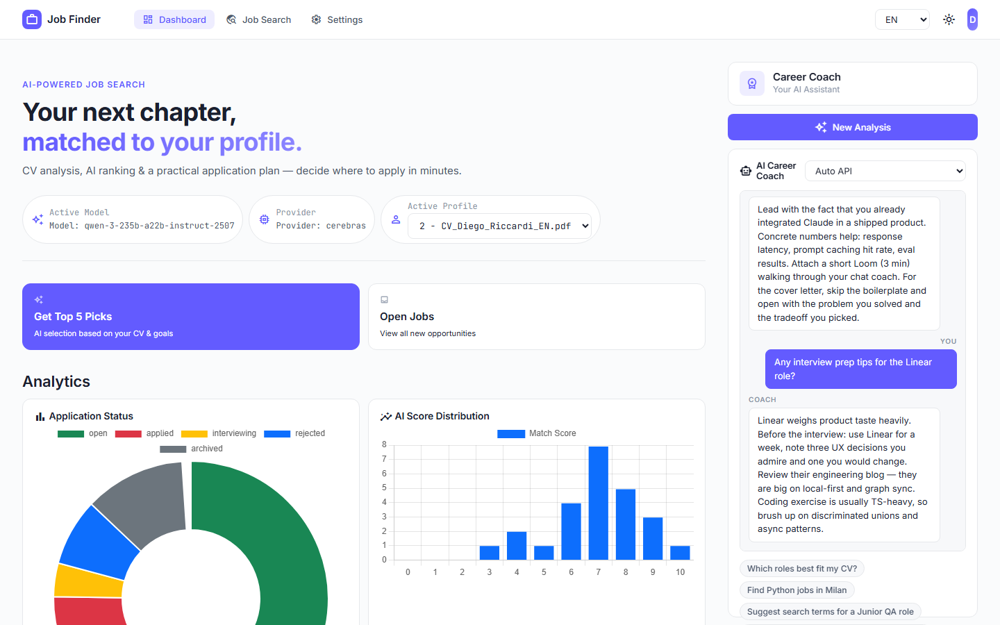 | 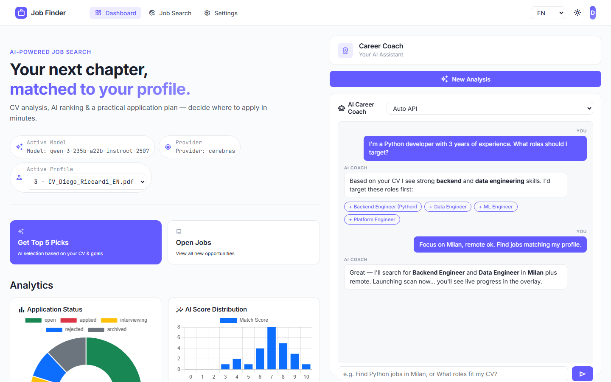 |
| Active Model + Profile and the analytics grid — Application Status & AI Score Distribution here; Top Companies & the AI Usage panel below. | Conversation with role pills (Backend Engineer, Data Engineer, ML Engineer, Platform Engineer) ready to one-click. |

| Job Search (flat layout) | Live scan progress |
|--------------------------|--------------------|
| 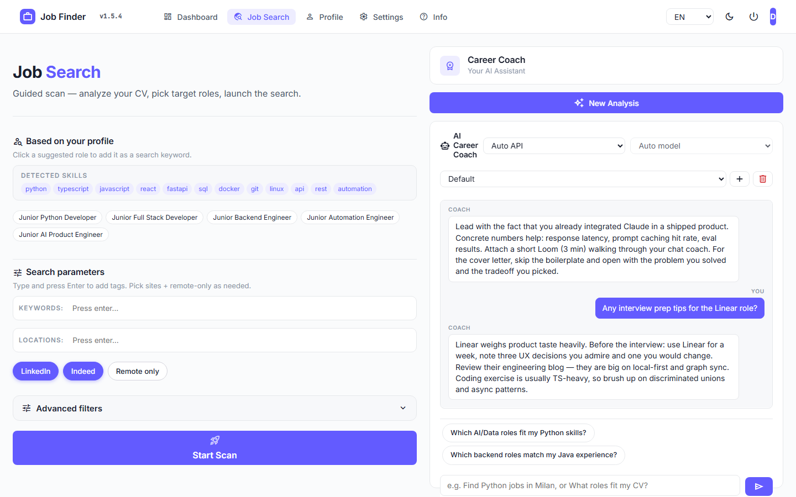 | 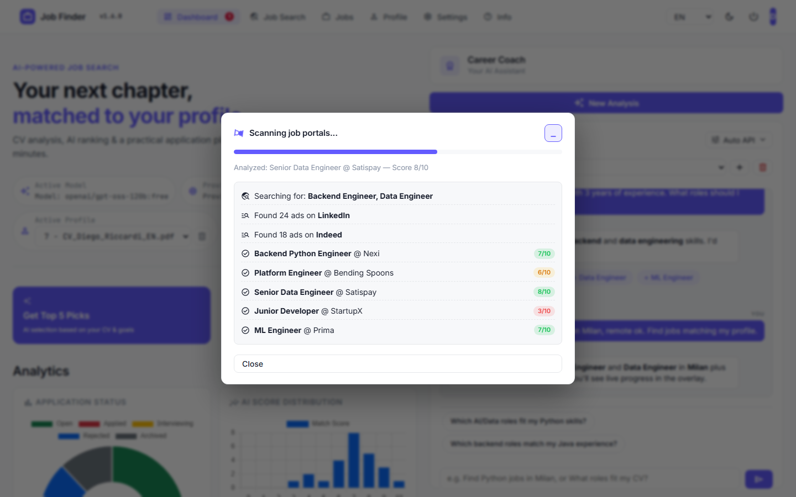 |
| Profile-derived role chips, tag-input keywords/locations, LinkedIn + Indeed + remote toggles, Start Scan. | Progress bar + per-job score chips (green/yellow/red) streamed via SSE. |

| Settings — AI providers | AI Usage panel (v1.5.4) |
|-------------------------|-------------------------|
| 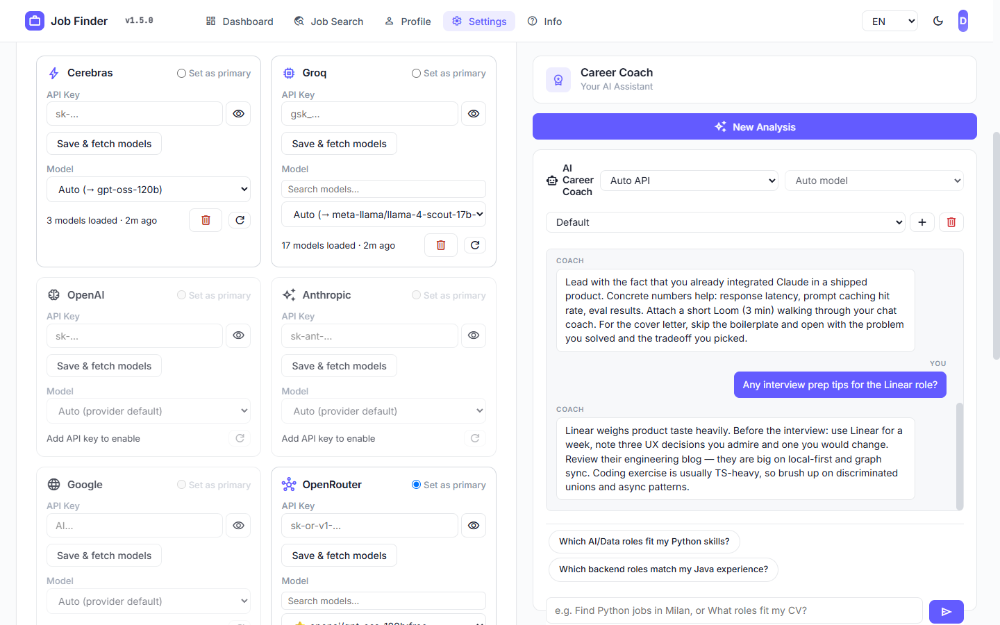 | 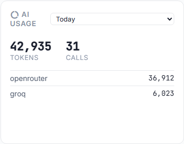 |
| Ten provider cards with searchable model pickers, ⭐-recommended models, "Auto (→ model)" hint, one-click key removal. | Tokens & calls per provider, over today / 7-day / 30-day / all-time. |

| Add a job manually (v1.5.4) | Per-job timeline + notes (v1.5.4) |
|-----------------------------|-----------------------------------|
| 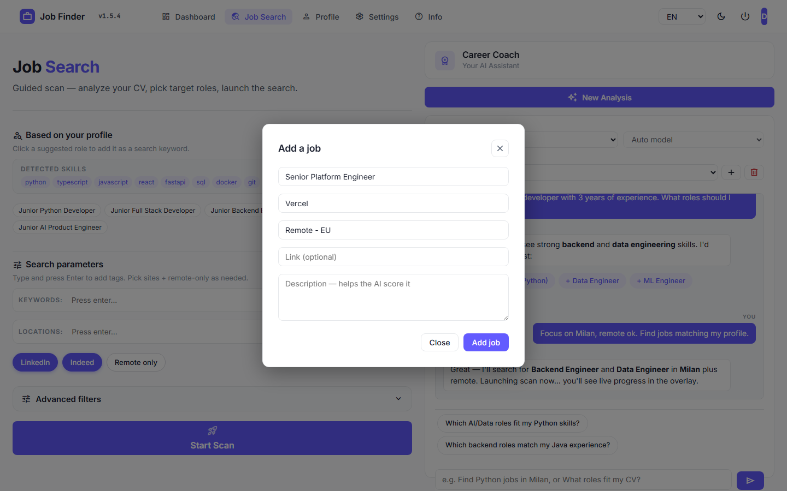 | 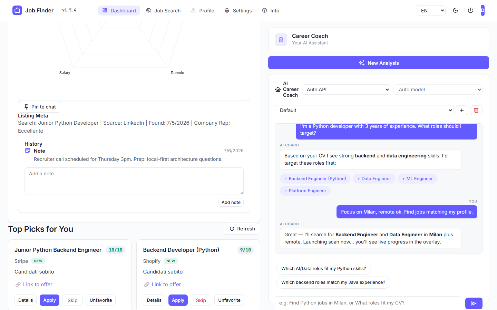 |
| Track referrals or roles found off-board; AI-scored like any scanned job. | Status history and free-text notes in the job detail panel. |

| Dark mode (v1.5.3) | Quit + system tray (v1.5.2) |
|--------------------|-----------------------------|
| 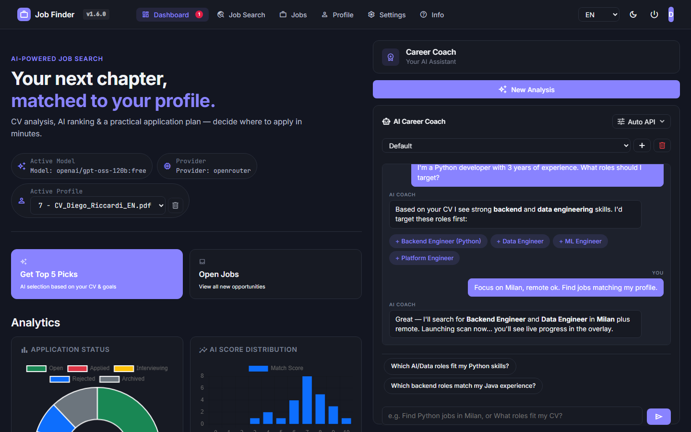 | The windowless build adds a header **Quit** button and a system-tray icon (Open / Quit). |
| The whole UI — dashboard, Info tab, modals — follows one consistent light/dark theme; toggle from the top bar. | (Tray icon lives next to the clock; not capturable in a browser screenshot.) |

---

## Architecture

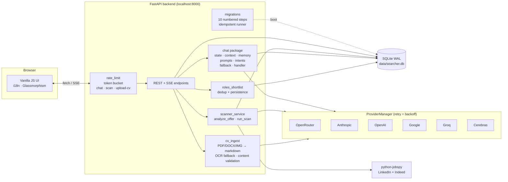

The chat service is split into single-responsibility modules:
`state` (chat state machine + preference extraction) ·
`context` (profile / preferences / jobs context blocks) ·
`prompts` (templates loaded from `app/prompts/chat/*.txt`) ·
`intents` (search / role-guidance heuristics) ·
`fallback` (rule-based answer when no LLM is available) ·
`handler` (orchestration + JSON-envelope parsing).

---

## Tech stack

| Layer | Technology |
|-------|-----------|
| Backend | Python 3.11+, FastAPI, uvicorn |
| Database | SQLite (WAL mode, `threading.Lock` shared connection, numbered migrations) |
| Frontend | Vanilla JS (ES2020 modules), CSS3 glassmorphism, no framework |
| AI / LLM | 10-provider factory: Cerebras, Groq, OpenAI, Anthropic, Google, OpenRouter, DeepSeek, xAI, GLM, Mistral — exponential-backoff retry |
| OCR | Tesseract 5.x (via `pytesseract` + `pdf2image`) — scanned PDFs and image CVs (JPG/PNG/AVIF/WEBP/TIFF). Bundle ships **5 languages**: EN/IT/ES/FR/DE (~13 MB tessdata) |
| Scraping | [python-jobspy](https://github.com/Bunsly/JobSpy) |
| Streaming | Server-Sent Events |
| Testing | pytest (unit, 385 tests), Playwright (E2E) |
| Quality | ruff, mypy strict, pre-commit, 59% line coverage |
| Deployment | Multi-stage Dockerfile + docker-compose, healthcheck, non-root user |
| Distribution | Standalone Windows bundle via PyInstaller (`make build-exe`) — Tesseract bundled, auto-update over GitHub Releases |
| Logging | stdlib `logging` + RotatingFileHandler → `data/logs/app.log` |

---

## Project structure

```
app/
├── main.py                  FastAPI app, AppContainer wiring
├── config.py                AppSettings + local secrets persistence
├── db.py                    SQLite Database (WAL + lock)
├── log.py                   Centralized logging setup
├── cv_ingest.py             CV → markdown → LLM summary + OCR fallback (Tesseract)
├── lifecycle.py             Post-scan retention/archive policy
├── models.py                Pydantic request/response models
├── rate_limit.py            Token-bucket limiter for /api/chat, /api/scan, /api/upload-cv
├── version.py               Version metadata + GitHub release checker
├── migrations/              Numbered SQLite schema migrations (idempotent runner)
├── prompts/chat/            System-prompt templates (.txt)
├── providers/               LLM factory + 10 provider implementations (retry + backoff)
└── services/
    ├── chat/                Chat package (state/context/memory/prompts/intents/fallback/handler)
    ├── chat_service.py      Backwards-compat facade
    ├── roles_shortlist.py   Role suggestion CRUD + dedup
    └── scanner_service.py   Job scraping + scoring orchestration
web/
├── app.js                   Bootstrap + per-feature wiring (ES module entry)
├── index.html               Single-page shell, mounts /web/* assets
├── modules/                 Feature modules (helpers, theme, shortlist, i18n, profile)
├── styles/                  Per-feature CSS (chat.css extracted)
├── styles.css               Core stylesheet (glassmorphism + tokens)
└── i18n/                    Per-locale JSON (en, it, es, fr, de — 617 keys each)
tests/
├── unit/                    pytest suite (385 tests, FakeProviderManager fixture)
└── e2e/                     Playwright specs (smoke, README screenshots, demo GIF)
scripts/
├── check_i18n.py            i18n coverage audit (fails CI on missing keys)
├── coverage_badge.py        coverage.xml → coverage.json shields.io endpoint
├── seed_demo.py             Pre-populate a demo DB for screenshots / GIF
├── update.py                Source-mode self-update (git pull + pip)
├── launch_exe.py            PyInstaller entry — workspace next to .exe, browser auto-open
├── updater.py               Bundled as Updater.exe — sync new release, preserve data/
└── build_exe.py             Local build wrapper: PyInstaller + zip + Tesseract bundling
JobFinder.spec               PyInstaller config (multi-EXE: JobFinder + Updater)
vendor/tesseract/            Bundled Tesseract OCR (created by build_exe.py)
```

---

## Quick start

### Prerequisites
- Python 3.11+
- At least one LLM API key (any of the 10 supported providers)
- Tesseract OCR (optional but recommended — required to upload image CVs and scanned PDFs):
  - **Windows**: `winget install UB-Mannheim.TesseractOCR`
  - **macOS**: `brew install tesseract tesseract-lang`
  - **Linux**: `sudo apt install tesseract-ocr tesseract-ocr-ita tesseract-ocr-eng`
  - The standalone Windows bundle ships a portable Tesseract — no manual install needed.
- Node.js (optional — only for Playwright E2E)

### Install & run

```bash
git clone https://github.com/DiegoRiccardi1234/job-finder.git
cd job-finder

python -m venv .venv
# Windows
.\.venv\Scripts\Activate.ps1
# macOS / Linux
source .venv/bin/activate

pip install -r requirements.txt
python run_webapp.py
```

Open **http://127.0.0.1:8000**.

### Run with Docker

```bash
cp .env.example .env   # add at least one LLM API key
docker compose up -d
```

The container exposes the app on `${PORT:-8000}` and persists the SQLite DB and logs in `./data/`. A built-in healthcheck pings `/api/health` every 30s.

### First-time setup

1. Open **Settings** and paste at least one LLM API key.
2. Upload your CV (PDF / DOCX / TXT, max 5 MB).
3. Chat with the AI Coach — it will ask about preferences.
4. Open **Job Search** and run the 3-step wizard (or let the chatbot pre-fill the form).
5. Review the dashboard and move jobs through the Kanban board.

---

## Localhost ≠ offline

The app runs entirely on your machine, but some features need internet:

| Works without internet | Requires internet |
|-------|-----------|
| UI navigation, filters, Kanban | Job scraping (LinkedIn / Indeed) |
| Local SQLite data | LLM chat / coaching |
| Existing scored jobs | AI scoring of newly scraped jobs |
| Manual status changes | Cover-letter generation |
| CSV export | Provider health checks |

When offline, online features fail gracefully and fall back to rule-based answers.

---

## Supported LLM providers

| Provider | Notes |
|----------|-------|
| **OpenRouter** | Single key, hundreds of models (Claude 4.x, GPT-5, Llama 4, Qwen 3, DeepSeek...) |
| **Cerebras** | Llama 4 Scout / Maverick, Qwen 3 235B — sub-second inference, free tier |
| **Groq** | Llama 4, Qwen 3, Kimi K2, DeepSeek — ultra-low latency |
| **OpenAI** | GPT-5, GPT-5 mini, o4-mini, o3 |
| **Anthropic** | Claude Opus 4.7, Sonnet 4.6, Haiku 4.5 |
| **Google** | Gemini 2.5 Pro & Flash, Gemini 2.0 Flash |
| **DeepSeek** | deepseek-chat, deepseek-reasoner — low cost |
| **xAI (Grok)** | Grok 4, Grok 3, Grok 3 mini |
| **Zhipu GLM** | GLM-4.6, GLM-4.5, GLM-4.5-Air |
| **Mistral** | Mistral Large, Small, Codestral |

The `ProviderManager` picks the first available provider from your configured order, skips a provider whose key is invalid (401), logs the choice, and exposes a `metadata()` endpoint for the UI status badge. New OpenAI-compatible providers subclass `OpenAICompatibleProvider` (base URL + default model).

---

## API endpoints

| Method | Endpoint | Description |
|--------|----------|-------------|
| GET | `/api/health` | Health + provider/key status |
| GET | `/api/providers/keys/status` | Per-provider configuration status |
| POST | `/api/providers/keys` | Save one or more provider keys + primary/preferred model |
| GET | `/api/providers/{name}/models` | Live list of models for one provider (`?force_refresh=1` bypasses 5-min cache) |
| POST | `/api/upload-cv` | Upload CV (size + MIME validated) |
| GET | `/api/profile` | Active candidate profile |
| PATCH | `/api/profile` | Update active profile's `preferred_roles` / `skills` / `languages` |
| GET | `/api/profiles` | List all uploaded CVs (multi-CV history) |
| POST | `/api/profiles/{id}/activate` | Switch the active candidate profile |
| GET | `/api/scan/stream` | SSE-streamed job scan |
| GET | `/api/jobs` | List jobs with filters |
| GET | `/api/jobs/{id}` | Job detail + AI analysis |
| POST | `/api/jobs/{id}/cover-letter` | Generate cover letter |
| POST | `/api/jobs/{id}/interview-prep` | Generate likely interview questions (toggleable) |
| POST | `/api/jobs/{id}/tailored-resume` | Generate a CV tailored to the listing (toggleable) |
| GET | `/api/skill-gap` | Aggregated missing-skill analysis (toggleable) |
| GET | `/api/scheduler/status` | Auto-scan status + pending highlights |
| POST | `/api/scheduler/config` | Configure auto-scan (enable, interval, threshold) |
| POST | `/api/scheduler/run-now` | Trigger an auto-scan immediately |
| POST | `/api/jobs/{id}/action` | Set status (apply/skip/archive) |
| POST | `/api/chat` | Chat with AI Career Coach (accepts optional `provider` + `model` overrides) |
| GET | `/api/analytics` | Dashboard stats |
| GET | `/api/recommendations` | Top AI-recommended jobs |

---

## Testing & Quality

The Makefile wraps the common loops:

```bash
make install      # pip + pre-commit hook
make test         # pytest unit suite (LLM-free via FakeProviderManager)
make coverage     # pytest --cov + html + shields.io badge JSON
make lint         # ruff check + ruff format --check + mypy strict
make fmt          # ruff --fix + ruff format
make e2e          # npm install + Playwright + browser tests
make build-exe    # PyInstaller -> dist/JobFinder-windows.zip
```

CI runs the same checks on Python 3.11 and 3.12. Drop `make` and call the underlying tools directly if you don't have it installed (`pip install -r requirements-dev.txt && pytest`, etc.).

Live LLM E2E tests are opt-in — set `RUN_LIVE_LLM=1` to run them; otherwise they skip gracefully so the offline pipeline stays green.

---

## Logging

Logging is configured once in `AppContainer.__init__`. Output goes to stderr **and** to a rotating log file at `data/logs/app.log` (1 MB × 3 backups). Set `LOG_LEVEL=DEBUG` to see provider selection details.

```
2026-04-22 22:08:43 | INFO    | app.main              | AppContainer initializing
2026-04-22 22:08:48 | INFO    | app.providers.factory | LLM provider active: openrouter (model=anthropic/claude-sonnet-4-6)
2026-04-22 22:09:01 | WARNING | app.services.scanner_service | scrape_jobs failed (term='QA Tester'): TimeoutError
```

---

## Rate limiting

`/api/chat`, `/api/scan`, and `/api/upload-cv` are guarded by an in-process token-bucket limiter (`app/rate_limit.py`). Per-IP defaults:

| Endpoint | Limit | Window |
|----------|-------|--------|
| `/api/chat` | 20 req | 60 s |
| `/api/scan` | 5 req | 60 s |
| `/api/upload-cv` | 10 req | 60 s |

Disable with `ENABLE_RATE_LIMIT=0`. Exceeded requests return `429` with a `Retry-After` header.

---

## Database migrations

Schema lives in numbered modules under `app/migrations/NNN_name.py`, each exposing `VERSION`, `DESCRIPTION`, and `def upgrade(conn)`. The runner in `app/migrations/__init__.py` applies pending migrations idempotently at startup, tracked in the `schema_version` table. Pre-existing databases are auto-baselined to the latest version.

To add a migration:

1. Create `app/migrations/004_my_change.py` with `VERSION = 4` and `def upgrade(conn)`.
2. Restart the app — migration runs once.
3. Add a regression test in `tests/unit/test_migrations.py`.

Existing migrations:
- `001_init.py` — initial 6-table schema.
- `002_chat_message_type.py` — `chat_messages.content_type` column.
- `003_candidate_profile_hash.py` — `candidate_profiles.content_hash` + index for upload dedup.
- `004_usage_log.py` — `usage_log` table for token tracking.
- `005_v130_multichat_pin_recruiter_name.py` — multi-chat sessions, pinned jobs, recruiter info, profile name.
- `006_job_dedup.py` — `jobs.dedup_key` + `jobs.sources_json` for cross-source dedup.
- `007_job_reminder.py` — `jobs.reminder_at` + `jobs.reminder_note` for application reminders.
- `008_saved_searches.py` — `saved_searches` table for named scan presets.
- `009_usage_latency.py` — `usage_log.duration_ms` for latency tracking.
- `010_jobs_list_index.py` — composite index on `jobs(status, punteggio_ai, last_seen_at)`.

---

## Local data

Everything lives in `data/`:
- `searcher.db` — SQLite (WAL journal mode)
- `local_secrets.json` — provider API keys (gitignored)
- `settings.json` — user preferences
- `logs/app.log` — rotating application log

Back up the `data/` folder before major updates.

---

## Documentation

- [DB schema reference](DOCS/schema.md) — table-by-table breakdown of `data/searcher.db`.
- [Security notes](DOCS/security.md) — localhost threat model, secret storage, network surface.
- [Contributing guide](CONTRIBUTING.md) — local dev workflow, Makefile targets, quality gates.
- [Security policy](SECURITY.md) — how to report vulnerabilities, scope, threat model.
- [Changelog](CHANGELOG.md) — release history.

## Changelog

See [CHANGELOG.md](CHANGELOG.md) for the full release history.

---

## License

MIT — see [LICENSE](LICENSE).
