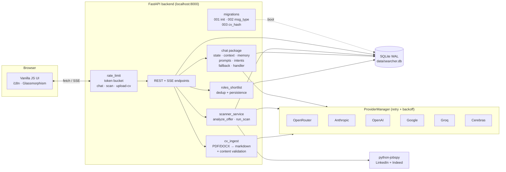

# Job Finder — AI-Powered Job Search Assistant

[](https://python.org)
[](https://fastapi.tiangolo.com)
[](https://sqlite.org)
[](https://github.com/DiegoRiccardi1234/Linkedin-searcher/actions/workflows/tests.yml)
[](https://github.com/DiegoRiccardi1234/Linkedin-searcher/actions/workflows/tests.yml)
[](LICENSE)
[](#supported-llm-providers)
[](https://mypy.readthedocs.io/)
[](https://github.com/astral-sh/ruff)
[](CHANGELOG.md)
[](https://github.com/DiegoRiccardi1234/Linkedin-searcher/releases/latest)

> A localhost-first AI-powered job search assistant. Scrape LinkedIn & Indeed, score offers against your CV with the LLM of your choice, and plan applications from a single dashboard.


> Upload CV → AI Coach suggests roles → one-click scan with live AI scoring.

---

## For non-developers (Windows)

Don't want to install Python? Grab the standalone Windows bundle from the [latest release](https://github.com/DiegoRiccardi1234/Linkedin-searcher/releases/latest):

1. Download `JobFinder-windows.zip` from the release assets.
2. Right-click → "Extract All" anywhere you like.
3. Open the extracted folder and double-click `JobFinder.exe`.
4. Your browser opens automatically on `http://127.0.0.1:8000`.
5. The app shows a "No API key configured" banner — click **Get a free Cerebras key** to register (no credit card, free tier, 30 seconds), copy your key into **Settings → API keys**, you're done.

Everything stays on your machine: the SQLite DB, your CV, your notes. The bundle is just Python packaged as a single executable, no telemetry, no remote calls except the LLM provider you configure and the LinkedIn / Indeed scrape.

> **Windows SmartScreen**: the first launch may show "Windows protected your PC". Click **More info** → **Run anyway**. The exe is unsigned (code-signing certificates cost ~$200/year and are out of scope for a personal project).

### Updates

When a new release ships, the dashboard surfaces an "Update available" banner. Click **Update now** — the app downloads the new version, replaces its files, and restarts itself, keeping all your data (CV, jobs, settings, API keys).

---

## Why this project

I built Job Finder while preparing my own transition into IT. Existing job boards push generic listings and waste hours on roles that don't fit. I wanted a tool that:

- knows my CV and preferences,
- scrapes real listings,
- ranks them with an LLM I control,
- and keeps everything **on my machine** — no third-party dashboard owns my data.

The result is a portfolio-grade FastAPI app with a multi-provider LLM backbone, a chat-driven UX, and an honest fallback when the network or the model is down.

---

## Features

- **Smart CV analysis** — Upload PDF / DOCX / TXT; the LLM extracts skills, seniority, and ideal roles.
- **Profile tab** — Inspect what the AI understood from your CV, edit `preferred_roles` / `skills` / `languages` inline (chip-list with PATCH), switch between previously uploaded CVs (multi-CV history with **Set active**).
- **AI Career Coach** — Chat that learns your preferences, suggests search terms, and can autofill the scan form via structured `action` payloads. Override the active provider **and model** per turn; a one-shot toast offers to persist the choice as default.
- **Provider cards** (Settings) — One card per LLM (Cerebras, Groq, OpenAI, Anthropic, Google, OpenRouter) with its own state (empty → configured → fetching → active), per-provider Save & fetch, ⭐-recommended model dropdown populated live from the provider's `list_models`, and a refresh button (5-min TTL cache).
- **Multi-source scan** — LinkedIn + Indeed in parallel, streamed via Server-Sent Events.
- **Personalized scoring** — Each job gets a 1-10 AI score with pros/cons and an apply/skip recommendation.
- **Kanban tracking** — Open → Applied → Interviewing → Rejected.
- **Cover-letter generator** — One-click, tailored to the job and your CV.
- **Multilingual UI** — English, Italian, Spanish, French, German (259 keys per locale, 100% parity).
- **Multi-LLM fallback** — Cerebras, Groq, OpenAI, Anthropic, Google, OpenRouter — configurable order.
- **Resilient by default** — Structured logging, no silent `except Exception`, WAL-mode SQLite, file size + MIME validation on uploads.

---

## Demo

The animated hero above walks through seven beats end-to-end:

1. **Dashboard** with personalized hero, analytics, and the always-on AI Career Coach.
2. **Settings** — six AI Provider cards with per-provider state, ⭐-recommended model dropdowns.
3. **Profile tab** — chip-list view of what the AI extracted from your CV + multi-CV history.
4. **Job Search wizard** — analyze your CV, pick roles from AI-suggested chips.
5. **Chat coach** — natural-language Q&A with clickable role pills.
6. **Live scan** — animated progress bar, per-job score chips (green/yellow/red), real-time feed.
7. Settle back on the dashboard with results.

A static look at the 3-step wizard, for readers who can't render the GIF:


> 🎯 Step 1 reads your active CV and surfaces matching role suggestions.
> ✨ Dark mode toggle in the top bar.

---

## Architecture



The chat service is split into single-responsibility modules:
`state` (chat state machine + preference extraction) ·
`context` (profile / preferences / jobs context blocks) ·
`prompts` (templates loaded from `app/prompts/chat/*.txt`) ·
`intents` (search / role-guidance heuristics) ·
`fallback` (rule-based answer when no LLM is available) ·
`handler` (orchestration + JSON-envelope parsing).

---

## Tech stack

| Layer | Technology |
|-------|-----------|
| Backend | Python 3.11+, FastAPI, uvicorn |
| Database | SQLite (WAL mode, `threading.Lock` shared connection, numbered migrations) |
| Frontend | Vanilla JS (ES2020 modules), CSS3 glassmorphism, no framework |
| AI / LLM | 6-provider factory: Cerebras, Groq, OpenAI, Anthropic, Google, OpenRouter — exponential-backoff retry |
| Scraping | [python-jobspy](https://github.com/Bunsly/JobSpy) |
| Streaming | Server-Sent Events |
| Testing | pytest (unit, 122 tests), Playwright (E2E) |
| Quality | ruff, mypy strict, pre-commit, 59% line coverage |
| Deployment | Multi-stage Dockerfile + docker-compose, healthcheck, non-root user |
| Distribution | Standalone Windows bundle via PyInstaller (`make build-exe`) — auto-update over GitHub Releases |
| Logging | stdlib `logging` + RotatingFileHandler → `data/logs/app.log` |

---

## Project structure

```
app/
├── main.py                  FastAPI app, AppContainer wiring
├── config.py                AppSettings + local secrets persistence
├── db.py                    SQLite Database (WAL + lock)
├── log.py                   Centralized logging setup
├── cv_ingest.py             CV → markdown → LLM summary + content validation
├── lifecycle.py             Post-scan retention/archive policy
├── models.py                Pydantic request/response models
├── rate_limit.py            Token-bucket limiter for /api/chat, /api/scan, /api/upload-cv
├── version.py               Version metadata + GitHub release checker
├── migrations/              Numbered SQLite schema migrations (idempotent runner)
├── prompts/chat/            System-prompt templates (.txt)
├── providers/               LLM factory + 6 provider implementations (retry + backoff)
└── services/
    ├── chat/                Chat package (state/context/memory/prompts/intents/fallback/handler)
    ├── chat_service.py      Backwards-compat facade
    ├── roles_shortlist.py   Role suggestion CRUD + dedup
    └── scanner_service.py   Job scraping + scoring orchestration
web/
├── app.js                   Bootstrap + per-feature wiring (ES module entry)
├── index.html               Single-page shell, mounts /web/* assets
├── modules/                 Feature modules (helpers, theme, shortlist, i18n, profile)
├── styles/                  Per-feature CSS (chat.css extracted)
├── styles.css               Core stylesheet (glassmorphism + tokens)
└── i18n/                    Per-locale JSON (en, it, es, fr, de — 259 keys each)
tests/
├── unit/                    pytest suite (122 tests, FakeProviderManager fixture)
└── e2e/                     Playwright specs (smoke, README screenshots, demo GIF)
scripts/
├── check_i18n.py            i18n coverage audit (fails CI on missing keys)
├── coverage_badge.py        coverage.xml → coverage.json shields.io endpoint
├── seed_demo.py             Pre-populate a demo DB for screenshots / GIF
├── update.py                Source-mode self-update (git pull + pip)
├── launch_exe.py            PyInstaller entry — workspace next to .exe, browser auto-open
├── updater.py               Bundled as Updater.exe — sync new release, preserve data/
└── build_exe.py             Local build wrapper: PyInstaller + zip
JobFinder.spec               PyInstaller config (multi-EXE: JobFinder + Updater)
```

---

## Quick start

### Prerequisites
- Python 3.11+
- At least one LLM API key (any of the 6 supported providers)
- Node.js (optional — only for Playwright E2E)

### Install & run

```bash
git clone https://github.com/DiegoRiccardi1234/Linkedin-searcher.git
cd Linkedin-searcher

python -m venv .venv
# Windows
.\.venv\Scripts\Activate.ps1
# macOS / Linux
source .venv/bin/activate

pip install -r requirements.txt
python run_webapp.py
```

Open **http://127.0.0.1:8000**.

### Run with Docker

```bash
cp .env.example .env   # add at least one LLM API key
docker compose up -d
```

The container exposes the app on `${PORT:-8000}` and persists the SQLite DB and logs in `./data/`. A built-in healthcheck pings `/api/health` every 30s.

### First-time setup

1. Open **Settings** and paste at least one LLM API key.
2. Upload your CV (PDF / DOCX / TXT, max 5 MB).
3. Chat with the AI Coach — it will ask about preferences.
4. Open **Job Search** and run the 3-step wizard (or let the chatbot pre-fill the form).
5. Review the dashboard and move jobs through the Kanban board.

---

## Localhost ≠ offline

The app runs entirely on your machine, but some features need internet:

| Works without internet | Requires internet |
|-------|-----------|
| UI navigation, filters, Kanban | Job scraping (LinkedIn / Indeed) |
| Local SQLite data | LLM chat / coaching |
| Existing scored jobs | AI scoring of newly scraped jobs |
| Manual status changes | Cover-letter generation |
| CSV export | Provider health checks |

When offline, online features fail gracefully and fall back to rule-based answers.

---

## Supported LLM providers

| Provider | Notes |
|----------|-------|
| **OpenRouter** | Single key, hundreds of models (Claude 4.x, GPT-5, Llama 4, Qwen 3, DeepSeek...) |
| **Cerebras** | Llama 4 Scout / Maverick, Qwen 3 235B — sub-second inference, free tier |
| **Groq** | Llama 4, Qwen 3, Kimi K2, DeepSeek — ultra-low latency |
| **OpenAI** | GPT-5, GPT-5 mini, o4-mini, o3 |
| **Anthropic** | Claude Opus 4.7, Sonnet 4.6, Haiku 4.5 |
| **Google** | Gemini 2.5 Pro & Flash, Gemini 2.0 Flash |

The `ProviderManager` picks the first available provider from your configured order, logs the choice, and exposes a `metadata()` endpoint for the UI status badge.

---

## API endpoints

| Method | Endpoint | Description |
|--------|----------|-------------|
| GET | `/api/health` | Health + provider/key status |
| GET | `/api/providers/keys/status` | Per-provider configuration status |
| POST | `/api/providers/keys` | Save one or more provider keys + primary/preferred model |
| GET | `/api/providers/{name}/models` | Live list of models for one provider (`?force_refresh=1` bypasses 5-min cache) |
| POST | `/api/upload-cv` | Upload CV (size + MIME validated) |
| GET | `/api/profile` | Active candidate profile |
| PATCH | `/api/profile` | Update active profile's `preferred_roles` / `skills` / `languages` |
| GET | `/api/profiles` | List all uploaded CVs (multi-CV history) |
| POST | `/api/profiles/{id}/activate` | Switch the active candidate profile |
| GET | `/api/scan/stream` | SSE-streamed job scan |
| GET | `/api/jobs` | List jobs with filters |
| GET | `/api/jobs/{id}` | Job detail + AI analysis |
| POST | `/api/jobs/{id}/cover-letter` | Generate cover letter |
| POST | `/api/jobs/{id}/action` | Set status (apply/skip/archive) |
| POST | `/api/chat` | Chat with AI Career Coach (accepts optional `provider` + `model` overrides) |
| GET | `/api/analytics` | Dashboard stats |
| GET | `/api/recommendations` | Top AI-recommended jobs |

---

## Testing & Quality

The Makefile wraps the common loops:

```bash
make install      # pip + pre-commit hook
make test         # pytest unit suite (LLM-free via FakeProviderManager)
make coverage     # pytest --cov + html + shields.io badge JSON
make lint         # ruff check + ruff format --check + mypy strict
make fmt          # ruff --fix + ruff format
make e2e          # npm install + Playwright + browser tests
make build-exe    # PyInstaller -> dist/JobFinder-windows.zip
```

CI runs the same checks on Python 3.11 and 3.12. Drop `make` and call the underlying tools directly if you don't have it installed (`pip install -r requirements-dev.txt && pytest`, etc.).

Live LLM E2E tests are opt-in — set `RUN_LIVE_LLM=1` to run them; otherwise they skip gracefully so the offline pipeline stays green.

---

## Logging

Logging is configured once in `AppContainer.__init__`. Output goes to stderr **and** to a rotating log file at `data/logs/app.log` (1 MB × 3 backups). Set `LOG_LEVEL=DEBUG` to see provider selection details.

```
2026-04-22 22:08:43 | INFO    | app.main              | AppContainer initializing
2026-04-22 22:08:48 | INFO    | app.providers.factory | LLM provider active: openrouter (model=anthropic/claude-sonnet-4-6)
2026-04-22 22:09:01 | WARNING | app.services.scanner_service | scrape_jobs failed (term='QA Tester'): TimeoutError
```

---

## Rate limiting

`/api/chat`, `/api/scan`, and `/api/upload-cv` are guarded by an in-process token-bucket limiter (`app/rate_limit.py`). Per-IP defaults:

| Endpoint | Limit | Window |
|----------|-------|--------|
| `/api/chat` | 20 req | 60 s |
| `/api/scan` | 5 req | 60 s |
| `/api/upload-cv` | 10 req | 60 s |

Disable with `ENABLE_RATE_LIMIT=0`. Exceeded requests return `429` with a `Retry-After` header.

---

## Database migrations

Schema lives in numbered modules under `app/migrations/NNN_name.py`, each exposing `VERSION`, `DESCRIPTION`, and `def upgrade(conn)`. The runner in `app/migrations/__init__.py` applies pending migrations idempotently at startup, tracked in the `schema_version` table. Pre-existing databases are auto-baselined to the latest version.

To add a migration:

1. Create `app/migrations/004_my_change.py` with `VERSION = 4` and `def upgrade(conn)`.
2. Restart the app — migration runs once.
3. Add a regression test in `tests/unit/test_migrations.py`.

Existing migrations:
- `001_init.py` — initial 6-table schema.
- `002_chat_message_type.py` — `chat_messages.content_type` column.
- `003_candidate_profile_hash.py` — `candidate_profiles.content_hash` + index for upload dedup.

---

## Local data

Everything lives in `data/`:
- `searcher.db` — SQLite (WAL journal mode)
- `local_secrets.json` — provider API keys (gitignored)
- `settings.json` — user preferences
- `logs/app.log` — rotating application log

Back up the `data/` folder before major updates.

---

## Documentation

- [DB schema reference](DOCS/schema.md) — table-by-table breakdown of `data/searcher.db`.
- [Security notes](DOCS/security.md) — localhost threat model, secret storage, network surface.
- [Contributing guide](CONTRIBUTING.md) — local dev workflow, Makefile targets, quality gates.
- [Security policy](SECURITY.md) — how to report vulnerabilities, scope, threat model.
- [Changelog](CHANGELOG.md) — release history.

## Changelog

See [CHANGELOG.md](CHANGELOG.md) for the full release history.

---

## License

MIT — see [LICENSE](LICENSE).
