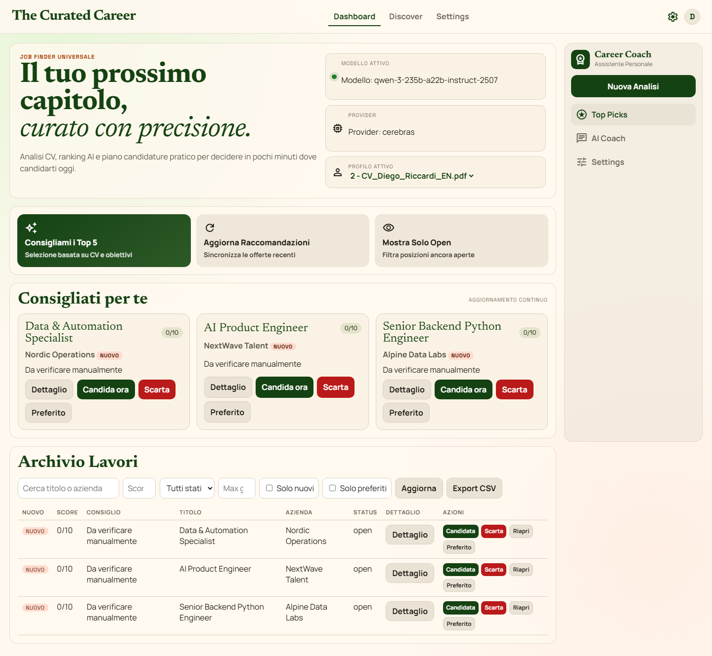
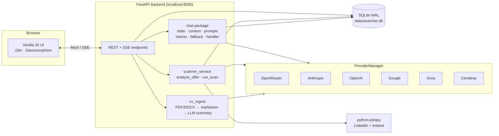

# Job Finder — AI-Powered Job Search Assistant

[](https://python.org)
[](https://fastapi.tiangolo.com)
[](https://sqlite.org)
[](https://github.com/YOUR_USERNAME/job-finder/actions/workflows/tests.yml)
[](LICENSE)
[](#supported-llm-providers)

> A localhost-first AI-powered job search assistant. Scrape LinkedIn & Indeed, score offers against your CV with the LLM of your choice, and plan applications from a single dashboard.

---

## Why this project

I built Job Finder while preparing my own transition into IT. Existing job boards push generic listings and waste hours on roles that don't fit. I wanted a tool that:

- knows my CV and preferences,
- scrapes real listings,
- ranks them with an LLM I control,
- and keeps everything **on my machine** — no third-party dashboard owns my data.

The result is a portfolio-grade FastAPI app with a multi-provider LLM backbone, a chat-driven UX, and an honest fallback when the network or the model is down.

---

## Features

- **Smart CV analysis** — Upload PDF / DOCX / TXT; the LLM extracts skills, seniority, and ideal roles.
- **AI Career Coach** — Chat that learns your preferences, suggests search terms, and can autofill the scan form via structured `action` payloads.
- **Multi-source scan** — LinkedIn + Indeed in parallel, streamed via Server-Sent Events.
- **Personalized scoring** — Each job gets a 1-10 AI score with pros/cons and an apply/skip recommendation.
- **Kanban tracking** — Open → Applied → Interviewing → Rejected.
- **Cover-letter generator** — One-click, tailored to the job and your CV.
- **Multilingual UI** — English, Italian, Spanish, French, German (150 keys, 100% coverage).
- **Multi-LLM fallback** — Cerebras, Groq, OpenAI, Anthropic, Google, OpenRouter — configurable order.
- **Resilient by default** — Structured logging, no silent `except Exception`, WAL-mode SQLite, file size + MIME validation on uploads.

---

## Demo

> Dashboard with AI-scored job listings and recommendations.



> A short GIF demo (CV upload → chat → scan → ranked results) lives at `screenshots/readme/demo.gif` once captured via `tests/e2e`.

---

## Architecture



The chat service is split into single-responsibility modules:
`state` (chat state machine + preference extraction) ·
`context` (profile / preferences / jobs context blocks) ·
`prompts` (templates loaded from `app/prompts/chat/*.txt`) ·
`intents` (search / role-guidance heuristics) ·
`fallback` (rule-based answer when no LLM is available) ·
`handler` (orchestration + JSON-envelope parsing).

---

## Tech stack

| Layer | Technology |
|-------|-----------|
| Backend | Python 3.11+, FastAPI, uvicorn |
| Database | SQLite (WAL mode, `threading.Lock` shared connection) |
| Frontend | Vanilla JS (ES2020), CSS3 glassmorphism, no framework |
| AI / LLM | 6-provider factory: Cerebras, Groq, OpenAI, Anthropic, Google, OpenRouter |
| Scraping | [python-jobspy](https://github.com/Bunsly/JobSpy) |
| Streaming | Server-Sent Events |
| Testing | pytest (unit, 23 tests), Playwright (E2E) |
| Logging | stdlib `logging` + RotatingFileHandler → `data/logs/app.log` |

---

## Project structure

```
app/
├── main.py                  FastAPI app, AppContainer wiring
├── config.py                AppSettings + local secrets persistence
├── db.py                    SQLite Database (WAL + lock)
├── log.py                   Centralized logging setup
├── cv_ingest.py             CV → markdown → LLM summary
├── lifecycle.py             Post-scan retention/archive policy
├── models.py                Pydantic request/response models
├── prompts/chat/            System-prompt templates (.txt)
├── providers/               LLM factory + 6 provider implementations
└── services/
    ├── chat/                Chat package (state/context/prompts/intents/fallback/handler)
    ├── chat_service.py      Backwards-compat facade
    └── scanner_service.py   Job scraping + scoring orchestration
web/                         Vanilla JS UI + i18n JSON
tests/
├── unit/                    pytest unit tests (config, log, db, chat, factory)
└── e2e/                     Playwright end-to-end tests
scripts/check_i18n.py        i18n coverage audit (fails CI on missing keys)
```

---

## Quick start

### Prerequisites
- Python 3.11+
- At least one LLM API key (any of the 6 supported providers)
- Node.js (optional — only for Playwright E2E)

### Install & run

```bash
git clone https://github.com/YOUR_USERNAME/job-finder.git
cd job-finder

python -m venv .venv
# Windows
.\.venv\Scripts\Activate.ps1
# macOS / Linux
source .venv/bin/activate

pip install -r requirements.txt
python run_webapp.py
```

Open **http://127.0.0.1:8000**.

### First-time setup

1. Open **Settings** and paste at least one LLM API key.
2. Upload your CV (PDF / DOCX / TXT, max 5 MB).
3. Chat with the AI Coach — it will ask about preferences.
4. Run a job scan from Settings (or let the chatbot pre-fill the form).
5. Review the dashboard and move jobs through the Kanban board.

---

## Localhost ≠ offline

The app runs entirely on your machine, but some features need internet:

| Works without internet | Requires internet |
|-------|-----------|
| UI navigation, filters, Kanban | Job scraping (LinkedIn / Indeed) |
| Local SQLite data | LLM chat / coaching |
| Existing scored jobs | AI scoring of newly scraped jobs |
| Manual status changes | Cover-letter generation |
| CSV export | Provider health checks |

When offline, online features fail gracefully and fall back to rule-based answers.

---

## Supported LLM providers

| Provider | Notes |
|----------|-------|
| **OpenRouter** | Single key, hundreds of models (Claude, GPT, Llama, Mistral...) |
| **Cerebras** | Llama 3.3 70B, very fast inference, generous free tier |
| **Groq** | Llama / Mixtral, sub-second responses |
| **OpenAI** | GPT-4o / GPT-4.1 / o-series |
| **Anthropic** | Claude 3.7 Sonnet, Claude 3.5 Haiku |
| **Google** | Gemini 1.5/2.0 Pro & Flash |

The `ProviderManager` picks the first available provider from your configured order, logs the choice, and exposes a `metadata()` endpoint for the UI status badge.

---

## API endpoints

| Method | Endpoint | Description |
|--------|----------|-------------|
| GET | `/api/health` | Health + provider/key status |
| POST | `/api/upload-cv` | Upload CV (size + MIME validated) |
| GET | `/api/profile` | Active candidate profile |
| GET | `/api/scan/stream` | SSE-streamed job scan |
| GET | `/api/jobs` | List jobs with filters |
| GET | `/api/jobs/{id}` | Job detail + AI analysis |
| POST | `/api/jobs/{id}/cover-letter` | Generate cover letter |
| POST | `/api/jobs/{id}/action` | Set status (apply/skip/archive) |
| POST | `/api/chat` | Chat with AI Career Coach |
| GET | `/api/analytics` | Dashboard stats |
| GET | `/api/recommendations` | Top AI-recommended jobs |

---

## Testing

```bash
# Unit tests (fast, no network, no SDK dependencies)
pip install -r requirements-dev.txt
pytest

# i18n coverage audit
python scripts/check_i18n.py

# E2E (browser)
npm install
npx playwright install chromium
npm run test:e2e
```

The unit suite uses a `FakeProviderManager` fixture so it runs without any LLM API key.

---

## Logging

Logging is configured once in `AppContainer.__init__`. Output goes to stderr **and** to a rotating log file at `data/logs/app.log` (1 MB × 3 backups). Set `LOG_LEVEL=DEBUG` to see provider selection details.

```
2026-04-22 22:08:43 | INFO    | app.main              | AppContainer initializing
2026-04-22 22:08:48 | INFO    | app.providers.factory | LLM provider active: openrouter (model=anthropic/claude-3.5-sonnet)
2026-04-22 22:09:01 | WARNING | app.services.scanner_service | scrape_jobs failed (term='QA Tester'): TimeoutError
```

---

## Local data

Everything lives in `data/`:
- `searcher.db` — SQLite (WAL journal mode)
- `local_secrets.json` — provider API keys (gitignored)
- `settings.json` — user preferences
- `logs/app.log` — rotating application log

Back up the `data/` folder before major updates.

---

## License

MIT — see [LICENSE](LICENSE).
